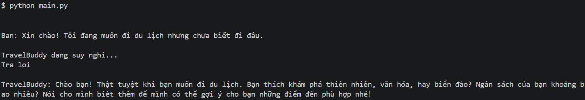
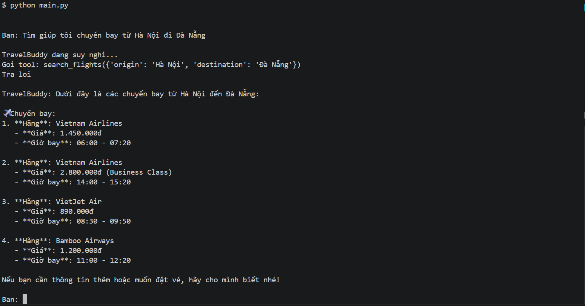
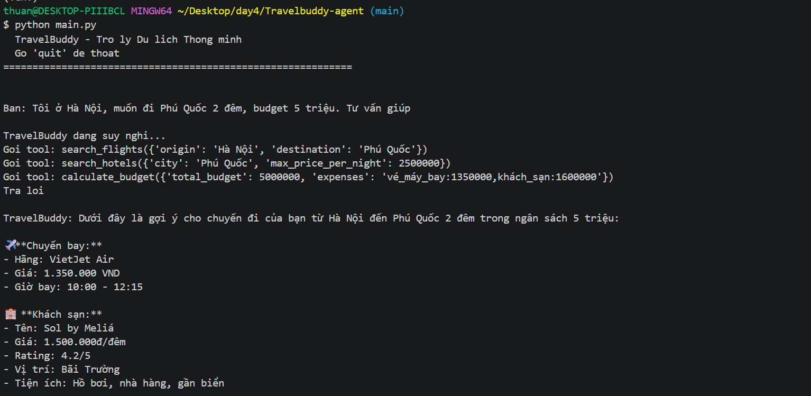
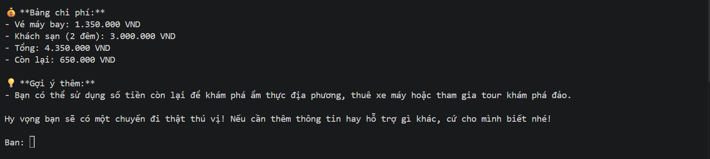
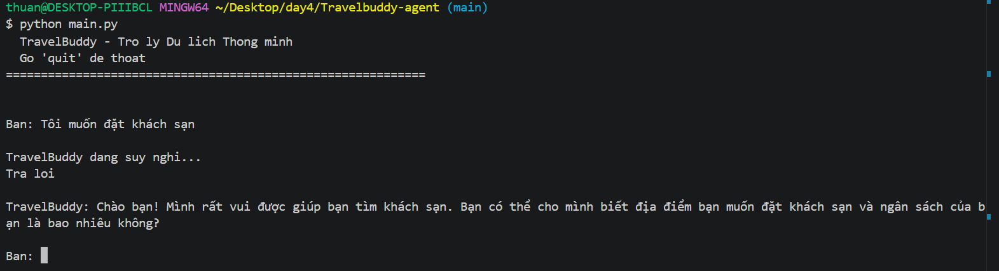
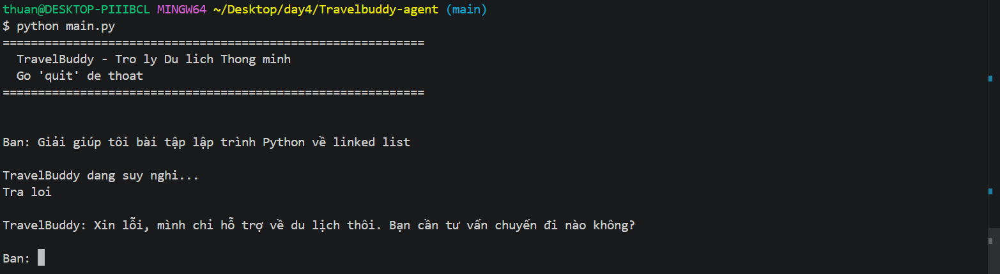

# LAB 4: TravelBuddy - Trợ lý Du lịch Thông minh với LangGraph

## Mô tả

Bài lab xây dựng một **AI Agent du lịch** sử dụng LangGraph, giúp người dùng lên kế hoạch chuyến đi bằng cách tự động tra cứu chuyến bay, kiểm tra ngân sách, và tìm kiếm khách sạn phù hợp.

Agent có khả năng **KẾT HỢP** thông tin từ nhiều nguồn để đưa ra gợi ý tối ưu — không chỉ trả lời từng câu rời rạc.

## Tech Stack

- **LangGraph**: Orchestration workflow cho agent
- **LangChain**: Tích hợp LLM và tools
- **OpenAI GPT-4o-mini**: Language model
- **Python 3.10+**

## Cài đặt

```bash
# Windows
python -m venv venv
venv\Scripts\activate
pip install -r requirements.txt

# Linux/Mac
python3 -m venv venv
source venv/bin/activate
pip install -r requirements.txt
```

## Cấu hình

Tạo file `.env` với API key:

```
OPENAI_API_KEY=your_openai_api_key_here
```

## Chạy

```bash
python main.py
```

## Cấu trúc Project

```
travelbuddy-agent/
├── .env                             # Environment variables (API keys)
├── .env.example                     # Template cho .env
├── .gitignore
├── main.py                          # Entry point - chat loop
├── requirements.txt                 # Python dependencies
├── travelbuddy/
│   ├── __init__.py
│   ├── agents/
│   │   ├── __init__.py
│   │   └── agent.py                 # LangGraph workflow + chat loop
│   ├── data/
│   │   ├── __init__.py
│   │   └── mock_data.py             # Mock data: FLIGHTS_DB, HOTELS_DB
│   ├── tools/
│   │   ├── __init__.py
│   │   └── tools.py                 # 3 tools: search_flights, search_hotels, calculate_budget
│   └── utils/
│       ├── __init__.py
│       └── system_prompt.txt        # System prompt (persona, rules, constraints)
└── tests/
    └── __init__.py
```
## Các Tool

### 1. search_flights(origin, destination)
Tra cứu chuyến bay từ mock data `FLIGHTS_DB`. Hỗ trợ tra ngược (destination → origin).

### 2. search_hotels(city, max_price_per_night)
Tìm khách sạn tại thành phố, lọc theo giá tối đa, sắp xếp theo rating giảm dần.

### 3. calculate_budget(total_budget, expenses)
Tính ngân sách còn lại từ chuỗi expenses dạng `tên:số_tiền,tên:số_tiền`.

## Mock Data

### Tuyến bay (FLIGHTS_DB)
| Tuyến | Số chuyến |
|-------|-----------|
| Hà Nội → Đà Nẵng | 4 |
| Hà Nội → Phú Quốc | 3 |
| Hà Nội → Hồ Chí Minh | 4 |
| Hồ Chí Minh → Đà Nẵng | 2 |
| Hồ Chí Minh → Phú Quốc | 2 |

### Khách sạn (HOTELS_DB)
| Thành phố | Số khách sạn |
|-----------|-------------|
| Đà Nẵng | 5 |
| Phú Quốc | 4 |
| Hồ Chí Minh | 4 |

## LangGraph Workflow

```
START → agent → [có tool call?] → tools → agent → ... → END
                ↓ không
               END
```

- **agent_node**: Nhận message, gọi LLM với system prompt, quyết định có gọi tool hay trả lời trực tiếp
- **tools_condition**: Routing — nếu LLM trả về tool_calls → chuyển sang tools node, ngược lại → END
- **tools_node**: Thực thi tool, trả kết quả về agent để tổng hợp

## Test Cases


| Test | Scenario | Kỳ vọng |
|------|----------|---------|
| 1 | Chào hỏi, chưa biết đi đâu | Trả lời thân thiện, hỏi thêm, KHÔNG gọi tool |
| 2 | Tìm chuyến bay Hà Nội → Đà Nẵng | Gọi search_flights, liệt kê kết quả |
| 3 | Tư vấn đầy đủ: Hà Nội → Phú Quốc, 2 đêm, 5 triệu | search_flights → search_hotels → calculate_budget → tổng hợp |
| 4 | Thiếu info: "Tôi muốn đặt khách sạn" | Hỏi lại thành phố, ngân sách, KHÔNG gọi tool |
| 5 | Không liên quan: "Viết code Python về linked list" | Từ chối lịch sự, chỉ hỗ trợ du lịch |

### Test case 1:



### Test case 2:



### Test case 3:




### Test case 4:



### Test case 5:


